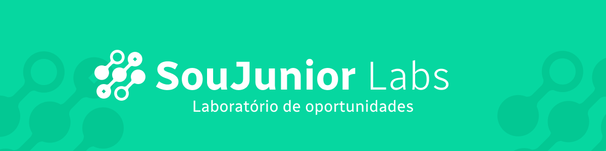
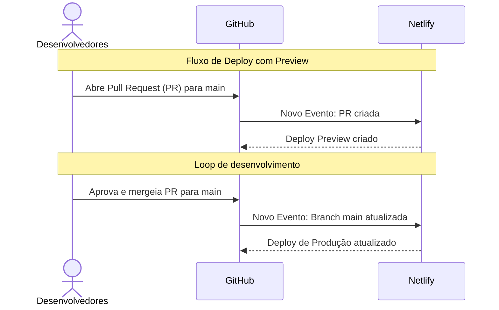

<div align="center">
  
</div>
<div align="center">
  
  
  
  
  
  
</div>

# salvando-labs

Salvando Labs é uma plataforma desenvolvida para gerenciar os produtos da comunidade open-source SouJunior Labs. Este projeto tem como objetivo centralizar e facilitar o gerenciamento dos produtos criados pela comunidade, proporcionando um ambiente colaborativo e eficiente.



### Obs. Para colaboradores da organização

> Antes dos passos de instalação do projeto lembre-se sempre de forkar o repositório oficial e só realizar alterações no repositório "forkado" enviando modificações através de Pull Requests.
> Nunca modifique diretamente o repositório oficial(upstream).

## Menu

### [Instalação](#instalação)

### [Variáveis de Ambiente](#variáveis-de-ambiente)

### [O que é o SouJunior Labs?](#o-que-é-o-soujunior-labs)

### [Como surgiu o Salvando-Labs?](#como-surgiu-o-salvando-labs)

### [Onde estamos e para onde vamos?](#onde-estamos-e-para-onde-vamos)

### [Stacks Utilizadas](#stacks-utilizadas)

## Instalação

> **Pré-requisitos**: Node.js e npm instalados.

1. Clone o repositório:

```bash
git clone https://github.com/SouJunior-Labs/salvando-labs.git
```

2. Entre na pasta do projeto:

```bash
cd salvando-labs
```

3. Instale as dependências:

```bash
npm install
```

4. Inicie o servidor de desenvolvimento:

```bash
npm run dev
```

5. Acesse o projeto no navegador:

```bash
http://localhost:5173
```

## Variáveis de Ambiente

Você pode verificar o repositório da API do labs [aqui](https://github.com/SouJunior-Labs/labs-api) e seguir as instruções para rodar a API localmente.

Após configurar a API, você precisará configurar as variáveis de ambiente do projeto para que a aplicação possa se comunicar com a API.

Para isso, crie um arquivo `.env` na raiz do projeto e adicione a variável `VITE_API_URL` com o endereço da API:

```bash
VITE_API_URL= http://localhost:3000
```

## O que é o SouJunior Labs?

Somos uma iniciativa voluntária comprometida em criar produtos reais. Nosso propósito é oferecer suporte àqueles que buscam experiência prática, atráves da criação colaborativa de produtos inovadores, assim impulsionamos o desenvolvimento profissional dos membros da comunidade.

Em nossa comunidade, você encontrará todas as áreas de atuação de um projeto real, como desenvolvimento de software, design, marketing, gestão de projetos, entre outros. Além disso, você terá a oportunidade de trabalhar em um ambiente colaborativo e multidisciplinar, onde poderá aprender e ensinar com outros membros da comunidade.

Mas não é só isso! Se você já tem experiência e deseja contribuir com a comunidade, também temos espaço para você. Aqui como mentor, você poderá compartilhar seu conhecimento e experiência com outros membros, além de se desenvolver em habilidades como liderança, gestão de projetos, comunicação e muito mais.

## Como surgiu o Salvando-Labs?

O Salvando Labs se originou da dificuldade dos administradores e founders da comunidade SouJunior Labs em gerenciar os produtos criados dentro da comunidade. A necessidade de um ambiente centralizado e eficiente para gerenciar os produtos criados pela comunidade foi o que motivou a criação do projeto.

Os administradores e founders da comunidade perceberam que, com o crescimento da comunidade, era necessário um ambiente que facilitasse o gerenciamento dos produtos criados, pois a comunidade estava crescendo e a quantidade de produtos criados estava aumentando.

Depois de mais de dezenas de produtos sendo desenvolvidos em paralelo, os administradores e founders perceberam que era necessário um ambiente centralizado e eficiente para automatizar algumas tarefas da rotina do administrador e do founder.

## Onde estamos e para onde vamos?

Estamos em nossa versão inicial e, portanto, ainda há muito a ser feito. No entanto, não estamos sozinhos! Com muita dedicação e trabalho em equipe, estamos construindo uma plataforma que atenda às necessidades da comunidade e que seja um ambiente colaborativo e eficiente para gerenciar os produtos.

Acreditamos que, com o tempo, a plataforma se tornará uma ferramenta essencial para a comunidade, facilitando rotinas e processos, além de proporcionar estrutura para receber todos os novos membros e produtos que estão por vir.

### Stacks Utilizadas

**Framework JavaScript:**
 <br>
**Biblioteca de Componentes:**
 <br>
**Outras tecnologias:**


 <br>
**Ferramentas de Desenvolvimento:**


## DevOps



## Links Úteis

- [API do Projeto](https://github.com/SouJunior-Labs/labs-api)
- [Comunidade SouJunior Labs](https://soujunior.bcns.ai/labs)
- [Plataforma SouJunior Labs](https://labs.soujunior.tech)
